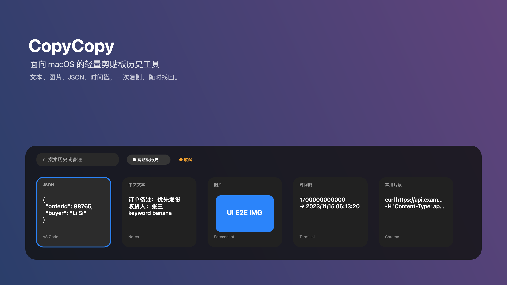
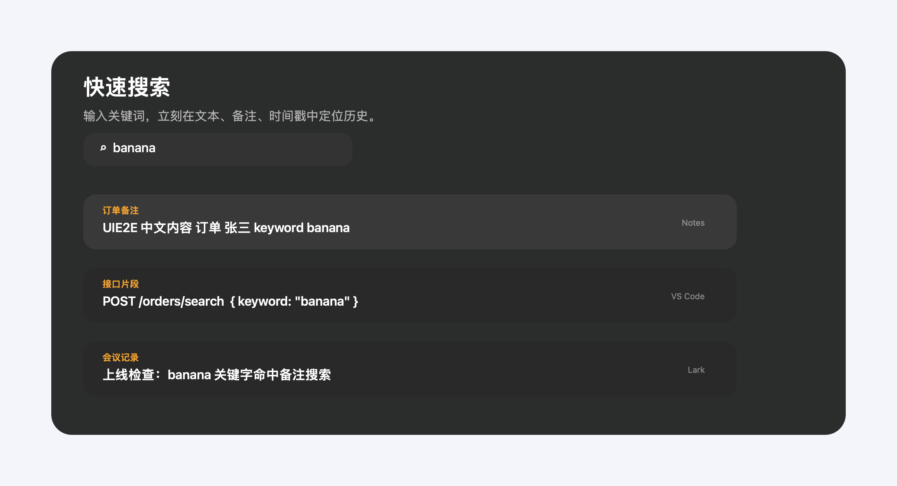
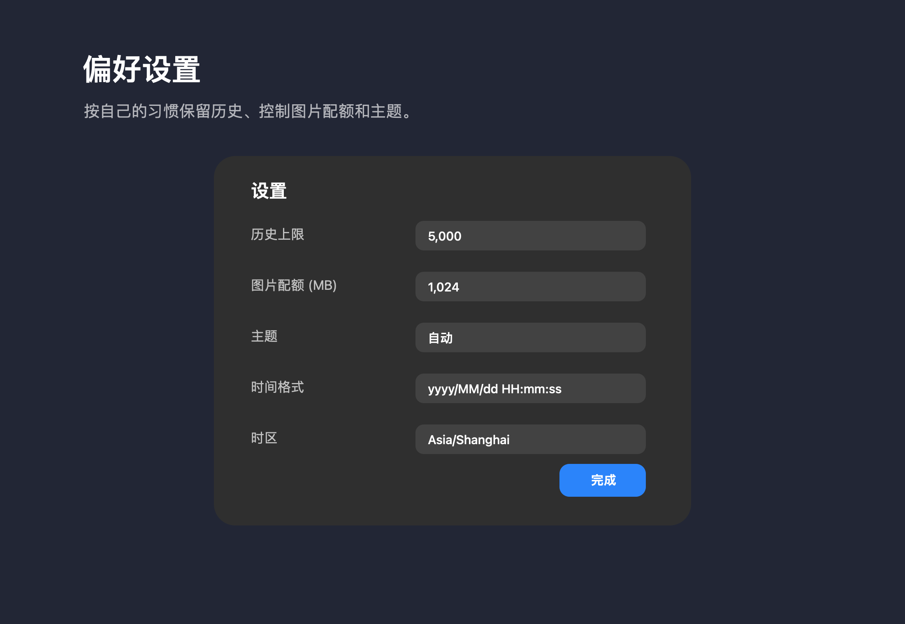

# CopyCopy

<p align="center">
  
</p>

<p align="center">
  <strong>一款面向 macOS 的轻量剪贴板历史工具。</strong><br />
  文本、图片、JSON、时间戳，一次复制，随时找回。
</p>

<p align="center">
  
  
  
  
</p>



## 为什么需要 CopyCopy？

每天写代码、查问题、处理工单时，我们会反复复制接口地址、订单号、JSON、截图、会议备注和命令片段。系统剪贴板只能记住最后一次复制，而 CopyCopy 会帮你把这些临时上下文保存下来：

- 刚复制过的文本、图片和代码片段可以快速找回。
- 常用内容可以收藏，避免被历史记录淹没。
- JSON、时间戳等开发者常见内容会被更友好地展示。
- 全程本地存储，不依赖云端服务。

> 当前项目仍处于个人开发和体验打磨阶段，欢迎试用、提 issue 或直接参与改进。

## 功能亮点

- **快捷呼出**：默认 `Control + ~` 显示/隐藏底部历史面板。
- **多类型历史**：自动捕获文本和图片，按时间倒序展示。
- **快速搜索**：支持按正文、备注、时间戳预览搜索历史记录。
- **键盘操作**：面板内可用方向键移动高亮，`Enter` 将选中内容复制回系统剪贴板。
- **图片缩略图**：截图和图片会落盘保存，并在面板里显示预览。
- **JSON 预览**：识别 JSON 文本，提供格式化预览窗口。
- **时间戳识别**：识别秒/毫秒时间戳，并按设置里的格式和时区展示。
- **收藏与清理**：支持收藏常用内容，也可一键仅保留收藏记录。
- **本地持久化**：历史数据基于 SQLite，本地图片保存在沙盒目录中。

## 界面预览

### 一眼找回最近复制


### 按关键词快速搜索



### 按习惯调整保留策略



## 快速开始

### 环境要求

- macOS 14.5 或更高版本（当前 Xcode 工程部署目标为 14.5）。
- Xcode 15+ / Swift 5.9+。
- 首次运行时，需要根据系统提示授予辅助功能、输入监控等权限，以支持全局快捷键和面板交互。

### 本地运行

```bash
git clone git@github.com:Hans941/copy-history.git
cd copy-history/app/ClipboardHistory
xcodebuild -scheme ClipboardHistory -configuration Debug -destination 'platform=macOS' build
open ~/Library/Developer/Xcode/DerivedData/ClipboardHistory-*/Build/Products/Debug/CopyCopy.app
```

也可以直接用 Xcode 打开：

```bash
open app/ClipboardHistory/ClipboardHistory.xcodeproj
```

然后选择 `ClipboardHistory` scheme，目标选择 `My Mac`，点击运行。

## 常用操作

| 操作 | 说明 |
| --- | --- |
| `Control + ~` | 显示/隐藏剪贴板历史面板 |
| `Option + F` | 面板已显示时聚焦搜索框 |
| `←` / `→` | 在历史卡片之间移动高亮 |
| `Enter` | 将当前高亮项复制回系统剪贴板 |
| `Esc` | 收起面板 |
| 右键卡片 | 编辑文本、收藏、复制、删除、JSON 预览等 |

## 数据存放位置

当前 App 开启了 macOS sandbox，真实数据通常位于：

```text
~/Library/Containers/hans941.ClipboardHistory/Data/Library/Application Support/ClipboardHistory/
```

主要文件：

- `clipboard.sqlite`：历史记录数据库。
- `static/`：图片文件目录。
- `settings.json`：历史上限、图片配额、主题、时间戳格式等设置。

## 项目结构

```text
app/
  ClipboardHistory/
    ClipboardHistory.xcodeproj        # Xcode 工程
    ClipboardHistory/                 # SwiftUI + AppKit 源码
    ClipboardHistoryTests/            # 单元测试
    ClipboardHistoryUITests/          # UI 测试骨架
docs/
  assets/                             # README 预览图
  feature/                            # 需求、方案、测试用例
  prd/                                # PRD 资料
```

## 技术架构

- **SwiftUI + AppKit**：SwiftUI 负责界面，AppKit 负责窗口、快捷键、菜单栏和系统剪贴板交互。
- **ClipboardWatcher**：轮询 `NSPasteboard`，捕获文本和图片变化。
- **ClipboardHistoryViewModel**：协调 watcher、store、设置、搜索、收藏、编辑和复制动作。
- **ClipboardHistoryStore**：SQLite + 本地图片目录，负责持久化、配额控制和图片生命周期。
- **KeyboardShortcutManager**：注册全局快捷键并处理面板显示/隐藏。

## 构建、测试与打包

### 运行测试

```bash
cd app/ClipboardHistory
xcodebuild test -scheme ClipboardHistory -configuration Debug -destination 'platform=macOS'
```

### 构建 Release

```bash
cd app/ClipboardHistory
xcodebuild build -scheme ClipboardHistory -configuration Release -destination 'platform=macOS'
```

Release 产物通常位于：

```text
~/Library/Developer/Xcode/DerivedData/ClipboardHistory-*/Build/Products/Release/CopyCopy.app
```

GitHub Release 资产按版本命名，避免覆盖旧版本下载包：`CopyCopy-{version}-arm64.dmg`、`CopyCopy-{version}-arm64.zip` 和 `SHA256SUMS.txt`。

> 注意：当前仓库没有提供正式签名和公证后的安装包。如果要发给普通用户，需要使用 Developer ID Application 证书签名并完成 notarization。

## 当前已知待优化

项目已经能覆盖核心剪贴板历史能力，但仍在持续打磨中：

- 更轻量的面板视觉和更强的快捷键提示。
- 更完整的 UI 自动化测试。
- 更完善的正式分发、签名和公证流程。
- 更丰富的快捷键自定义能力。

## 参与贡献

欢迎通过 issue 反馈使用体验、bug 或功能建议。如果你想直接改代码，建议先运行单元测试，再提交 PR。

## License

当前仓库暂未添加开源许可证。如果你希望复用代码，请先联系作者确认授权方式。
